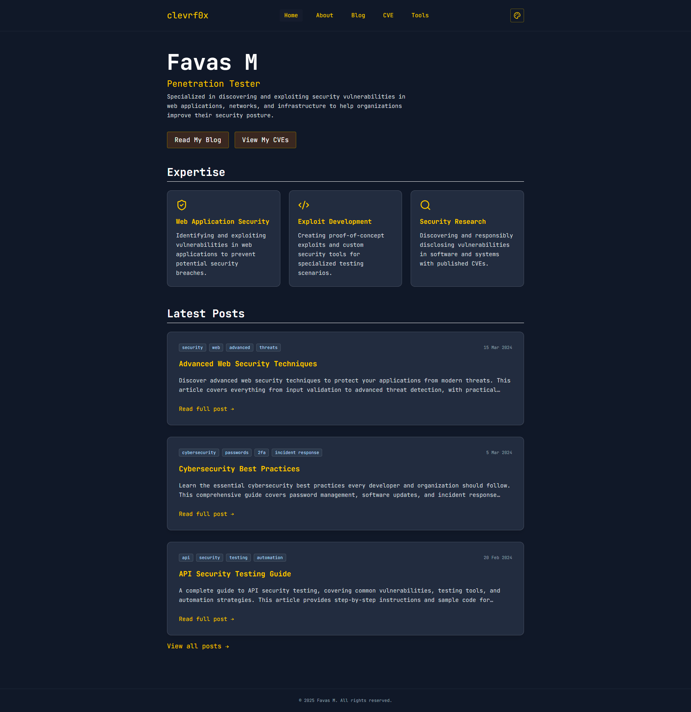
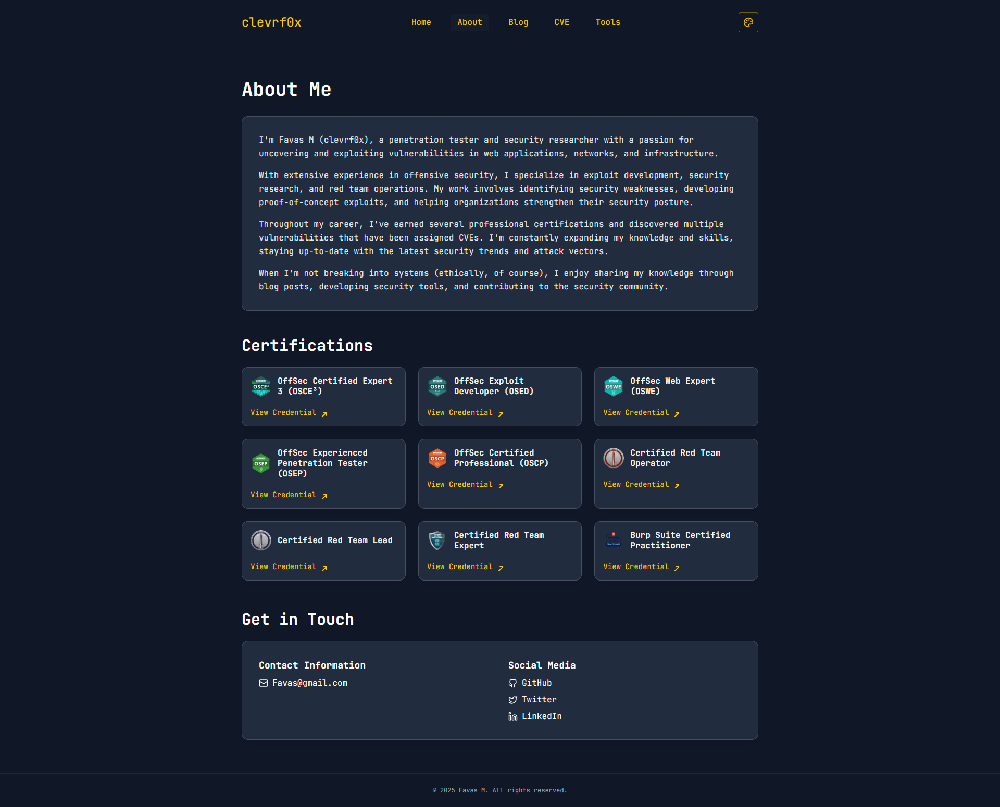
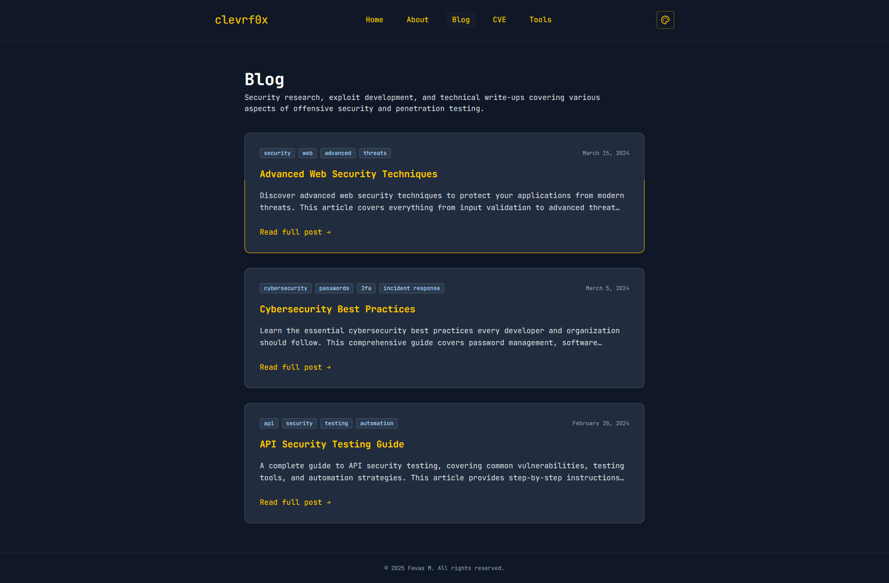
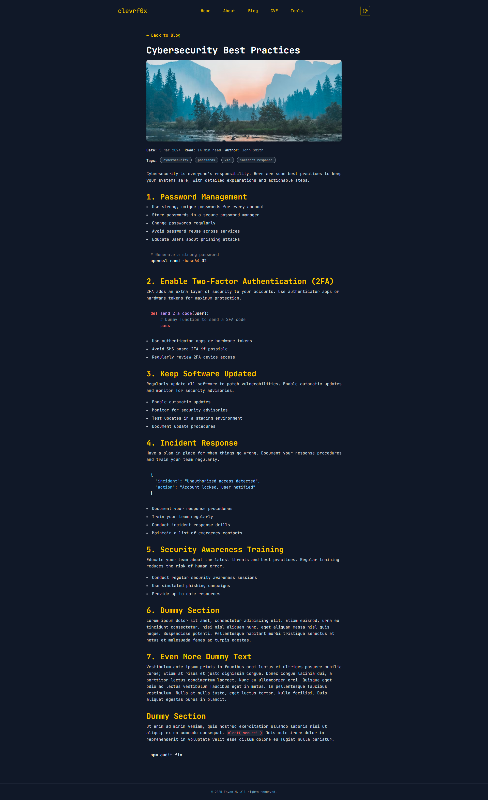
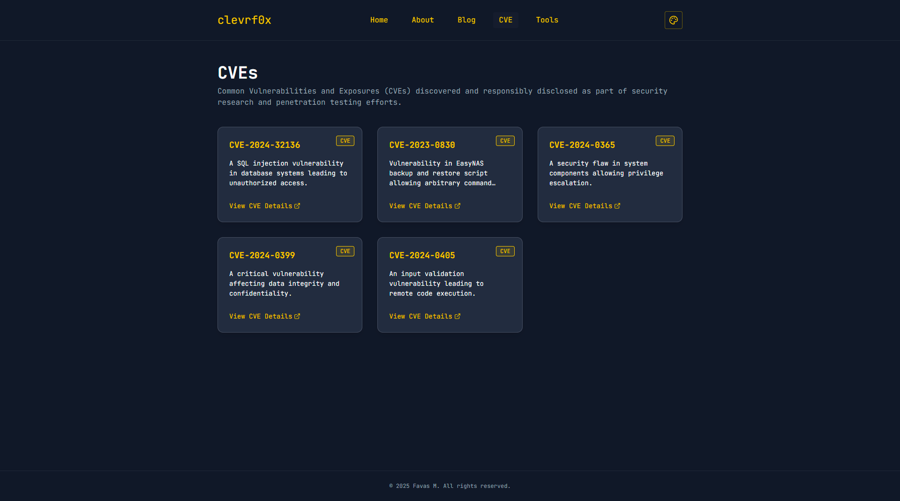
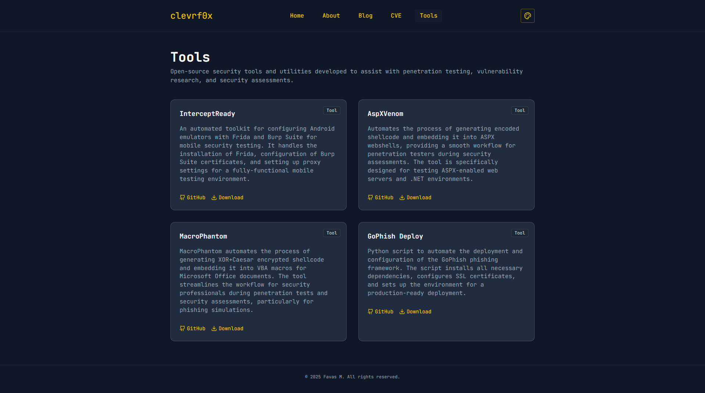
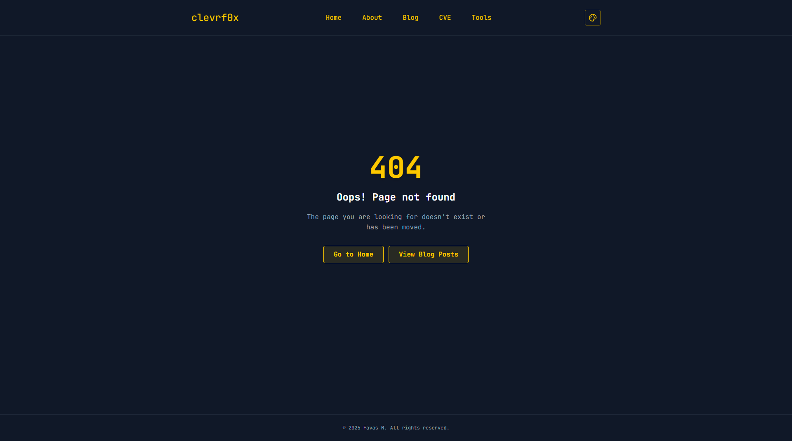

# Hackerfolio

A modern, responsive portfolio and blog site for penetration testers and security researchers. Built with React, Vite, and Tailwind CSS.

## 🚀 Features

- Responsive design with mobile-friendly navigation
- Blog system with markdown support
- CVE and tools showcase
- Dynamic color themes
- Easy to add new blog posts

---

## 📸 Screenshots

### Home Page



### About Page



### Blog List Page



### Blog Detail Page



### CVE Page



### Tools Page



### 404 Not Found Page



---

## 📝 Adding or Updating Blogs

1. **Add your markdown file:**

   - Place your new blog post as a `.md` file in `public/blogs/`.
   - Use [front-matter](https://github.com/jxson/front-matter) at the top of your file:

     ```markdown
     ---
     title: 'Your Blog Title'
     slug: 'your-blog-slug'
     excerpt: 'A short summary of your post.'
     date: '2024-06-20'
     readTime: '5 min read'
     author: 'Your Name'
     tags: tag1, tag2, tag3
     image: 'image-url'
     ---

     Your blog content here...
     ```

2. **Update the blog list in `App.jsx`:**

   - Open `src/App.jsx`.
   - Find the `BLOG_FILES` array near the top:
     ```js
     const BLOG_FILES = [
       'advanced-web-security.md',
       'cybersecurity-best-practices.md',
       'api-security-testing-guide.md',
       // Add your new file here:
       'your-blog-slug.md',
     ];
     ```
   - Add your new markdown filename to this array.

3. **Save and reload the site.**

   - Your new blog will appear in the blog list!

4. **To update a blog:**
   - Edit the corresponding markdown file in `public/blogs/`.
   - The changes will be reflected automatically.

---

## 🛠️ Local Development

1. Install dependencies:
   ```bash
   npm install
   ```
2. Start the dev server:
   ```bash
   npm run dev
   ```
3. Open [http://localhost:5173](http://localhost:5173) in your browser.

---

## 📄 License

This project is licensed under the MIT License. See [LICENSE](LICENSE) for details.

---

## 🙏 Acknowledgements

Special thanks to [xbz0n.sh](https://xbz0n.sh/) for design inspiration. If you enjoy security research and technical blogs, be sure to check out his site and [read his blogs](https://xbz0n.sh/).
